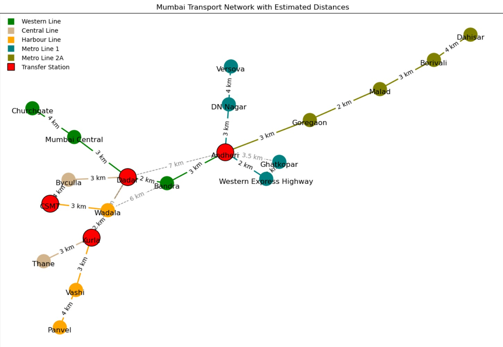

# 🚇 Mumbai Transport Network — Graph Analysis

> Coursework project modelling Mumbai's public transport system using graph data structures in Python, executed in Jupyter Notebook.

---

## 📌 Overview

This project models Mumbai's public transportation system by representing stations as **nodes** and connections between them as **edges**, with distances included as attributes. The graph is visualised with labelled stations and colour-coded lines for clarity and ease of interpretation.

---

## 🛠️ Libraries Used

| Library | Purpose |
|---|---|
| `networkx` | Represents the transport network as a graph. Nodes = stations, edges = connections. Provides tools for graph construction, analysis, and visualisation. |
| `matplotlib.pyplot` | Visualises the transport network. Allows full customisation of plots including node sizes, colours, labels, and legends. |

**Justification:** `networkx` is ideal for graph-based problems, while `matplotlib` ensures professional and readable visual outputs.

---

## 📊 Dataset Summary

The dataset represents Mumbai's transport network and is **manually constructed** to model the relationships between stations and their distances.

### Lines Included

| Line | Stations | Distance Range |
|---|---|---|
| Western Line | Churchgate → Mumbai Central → Dadar → Bandra → Andheri | 2 – 5 km |
| Central Line | CSMT → Byculla → Dadar → Kurla → Thane | 2.5 – 10 km |
| Harbour Line | Panvel → Vashi → Kurla → Wadala → CSMT | 4 – 20 km |
| Metro Line 1 | Versova → DN Nagar → Andheri → Western Express Highway → Ghatkopar | 1.5 – 3 km |
| Metro Line 2A | Dahisar → Borivali → Malad → Goregaon → Andheri | 2 – 4 km |

Each line's data consists of stations connected **sequentially**, with distances stored in kilometres between adjacent stations.

---

## 🎨 Visualisation

The graph is built using `networkx` and rendered with `matplotlib`. Key visual features include:

- **Colour-coded lines** — each of the five lines has a unique colour for quick visual differentiation
- **Labelled edges** — distances between adjacent stations are displayed on each edge
- **Transfer stations** — highlighted in **red** with larger nodes and bold borders, marking where passengers can switch between lines
- **Additional connections** — dashed grey edges represent supplementary connectivity paths added to ensure network completeness

### Network Output


### Colour Legend

| Line | Colour |
|---|---|
| Western Line | Green |
| Central Line | Tan |
| Harbour Line | Orange |
| Metro Line 1 | Teal |
| Metro Line 2A | Olive |
| Transfer Station | Red |

---

## 📈 Plot Interpretation

- **Nodes** represent transport stations; **edges** denote connections between them
- **Transfer stations** — Dadar, Kurla, and Andheri — are central hubs where multiple lines intersect, emphasising their importance in route planning
- The **spring layout** (`nx.spring_layout`) spreads nodes for maximum clarity, preventing visual overlap
- Shorter routes (e.g. Dadar → Kurla at 4 km) contrast with longer stretches (e.g. Panvel → Vashi at 20 km), reflecting the real-world geography of Mumbai's network

---

## ✅ Key Findings

- The visualisation clearly shows how different lines interconnect and the distances between stations
- Transfer stations are the most critical nodes — removing any one of them would significantly disrupt network connectivity
- Additional dashed connections demonstrate alternative travel paths, providing insight into route planning flexibility
- The dense connectivity of Mumbai's transport system is well represented by the graph structure

---

## 🚀 How to Run

1. Clone or download this repository
2. Open the `.ipynb` file in **Jupyter Notebook**
3. Install dependencies if not already installed:
   ```bash
   pip install networkx matplotlib
   ```
4. Run all cells in order (`Kernel → Restart & Run All`)

---

## 📁 Project Structure

```
├── mumbai_transport_network.ipynb   # Main Jupyter Notebook
├── README.md                        # Project documentation (this file)
```

---

## 👤 Author

Submitted as part of a Python & R programming coursework assignment.
